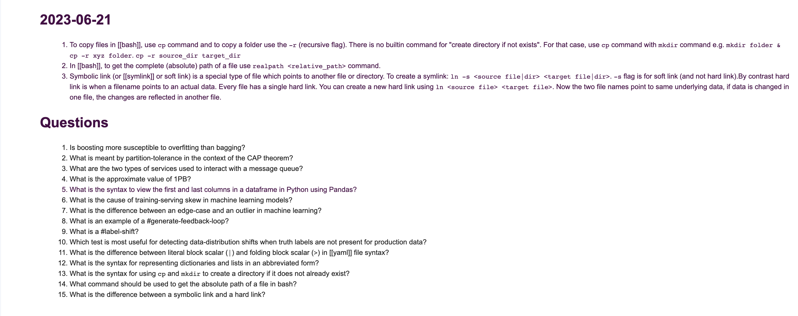

# rewiser-gpt

A github action to manage your daily devlogs and help you revise them regularly.


## How it works?

Like a regular github action.
1. Hook this github-action to your devlog repository
2. Mention the directory and file type where all the devlogs are stored
3. The action will figure out the order of the files and will use anki style algorithm to create your daily roster.
4. It will send the daily roster via email, for emails to work, it will require smtp hostname and credentials.

You need to add a `yml` file in your `.github/workflows` folder to setup this action.

Here's a complete example of how to set it up, you can add a similar example to your `.github/workflows` folder:

```yml

# name of your action/workflow
name: Send Devlogs Rewiser Email
on:
  
  # the schedule at which to send the email
  schedule:
    - cron: '30 01 * * *'
  workflow_dispatch:
jobs:
  send_email:
    name: send email
    runs-on: ubuntu-latest
    steps:
        # this checksout the github repository
      - name: Checkout
        uses: actions/checkout@v3
        with:
          fetch-depth: 0
        # this sends the daily email
      - name: Send devlog Email
        uses: mohit2152sharma/rewiser-gpt@v0.0.4
        with:

          # all the following are required parameters
          to_email: "mohitlakshya@gmail.com"
          from_email: "mohitsharma@saral.club"
          doc_directory: "devlogs"
          smtp_hostname: ${{ secrets.SMTP_ENDPOINT }}
          smtp_port: ${{ secrets.SMTP_PORT }}
          smtp_username: ${{ secrets.SMTP_USERNAME }}
          smtp_password: ${{ secrets.SMTP_PASSWORD }}
          openai_api_key: ${{ secrets.openai_api_key }}
```

If you provide an `OPENAI_API_KEY`, it will generate questions for texts available in the files. At the moment, each item of a numbered list is treated as a separate text and questions are generated for each of these texts. The output in email, looks as shown below:


